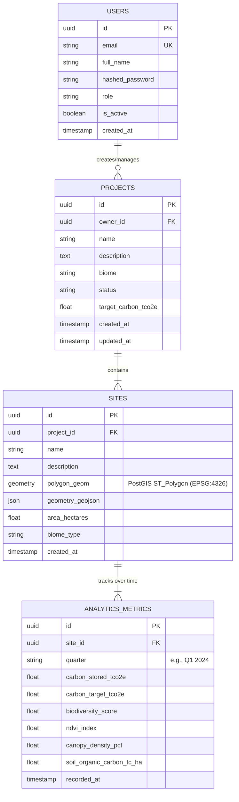

# Darukaa.Earth - Geospatial Carbon & Biodiversity Analytics Platform


**Darukaa.Earth** is a production-grade, full-stack geospatial data analytics platform designed to monitor, verify, and visualize high-integrity nature-based carbon removal and biodiversity conservation projects. Built for project developers, MRV (Measurement, Reporting, and Verification) auditors, and institutional carbon credit buyers.

---

## 🌟 Key Features & User Stories

1. **User Authentication & Authorization**:
   - Secure JWT-based authentication (HS256) with role-based access control (`Admin`, `Auditor`, `Project Developer`).
   - Protected REST API endpoints with automated Bearer token validation.

2. **Project & Portfolio Management**:
   - Comprehensive dashboard to create, configure, and inspect carbon/biodiversity restoration projects.
   - Categorized by biomes (Tropical Evergreen, Mangrove Wetlands, Montane Sholas, Dry Deciduous).
   - Real-time aggregation of total hectares, baseline carbon stock, and annual sequestration run rates.

3. **Geospatial Site Mapping (PostGIS + Mapbox GL JS)**:
   - Interactive vector map rendering bounding polygons of all monitored sites.
   - In-app polygon drawing tool to capture coordinates, automatically validate spatial integrity (`ST_IsValid`), and compute geodesic surface area in hectares via Shapely & PostGIS.
   - Dynamic map layer switching (Satellite, NDVI Vegetation Vigor Heatmap, Topographic relief).

4. **Longitudinal Performance & Analytics**:
   - Interactive time-series charts (Highcharts & Chart.js) visualizing quarterly metrics:
     - **Carbon Stock Sequestration**: Cumulative $tCO_2e$ compared against Verra VCS VM0047 benchmark projections.
     - **Shannon-Wiener Biodiversity Index**: Endemic species richness and Shannon diversity score ($0-100$).
     - **NDVI Vegetation Vigor**: Sentinel-2 remote sensing spectral vegetation index ($0.00-1.00$).
     - **Soil Organic Carbon (SOC)**: Soil carbon density in metric tons $C/ha$.

5. **Automated Code Quality & CI/CD Pipeline**:
   - Pre-commit hooks managed with **Husky** and **lint-staged** running **Prettier** and **ESLint**.
   - **GitHub Actions** CI pipeline automating Python unit tests (`pytest`), code formatting (`black`, `flake8`), and frontend production build verification on every commit.

---

## 🏛️ System Architecture

```
                                  +---------------------------+
                                  |   Web Browser (Client)    |
                                  |   React 18 + Vite + CSS   |
                                  +-------------+-------------+
                                                |
                             HTTPS / JSON REST  |  Mapbox GL Vector Tiles
                                                v
                                  +-------------+-------------+
                                  |    FastAPI Backend App    |
                                  |  (Python 3.11 + Uvicorn)  |
                                  +------+--------------+-----+
                                         |              |
                    SQLAlchemy / GeoAlchemy2     Shapely GeoJSON Engine
                                         |              |
                                         v              v
+-------------------------------------------------------------+
|               PostgreSQL 15 + PostGIS Database              |
|  - Users (RBAC, JWT Credentials)                            |
|  - Projects (Carbon Targets, Biome Classifications)         |
|  - Sites (ST_Polygon Geometries, Geodesic Hectares)         |
|  - AnalyticsMetrics (Quarterly Temporal Measurements)       |
+-------------------------------------------------------------+
```

---

## 🗄️ Database Schema & Entity Relationships



---

## 🚀 Quick Start Guide

### Option 1: One-Command Startup with Docker Compose (Recommended)

Requires [Docker Desktop](https://www.docker.com/products/docker-desktop/).

```bash
# 1. Clone or extract the repository
cd darukaa-earth

# 2. Launch the entire stack (PostGIS + FastAPI + React Frontend)
docker compose up --build
```

Once booted:
- **Frontend Dashboard**: [http://localhost:3000](http://localhost:3000)
- **FastAPI Backend & Interactive Swagger API Docs**: [http://localhost:8000/docs](http://localhost:8000/docs)
- **Default Admin Credentials**:
  - Email: `admin@darukaa.earth`
  - Password: `Admin@Darukaa2024`

---

### Option 2: Local Development Setup (Manual)

#### Prerequisites
- **Python 3.10+**
- **Node.js 18+** & `npm`
- **PostgreSQL 14+ with PostGIS** (or use the built-in SQLite/JSON fallback engine automatically)

#### 1. Backend Setup
```bash
cd backend

# Create virtual environment
python -m venv venv
# On Windows:
.\venv\Scripts\activate
# On Linux/macOS:
source venv/bin/activate

# Install dependencies
pip install -r requirements.txt

# Run migrations and start API server
uvicorn app.main:app --reload --port 8000
```

The server will automatically generate seed data with 4 sample carbon projects and 7 geospatial polygon sites.

#### 2. Frontend Setup
```bash
cd ../frontend

# Install dependencies
npm install

# Start Vite dev server
npm run dev
```

Open your browser to [http://localhost:5173](http://localhost:5173).

---

## 🧪 Testing & Code Quality

### Run Automated Backend Tests
```bash
cd backend
pytest -v
```
Covers:
- JWT registration, authentication, and invalid credential handling.
- Project creation and retrieval.
- Site polygon validation (`ST_IsValid` & GeoJSON coordinates).
- Longitudinal analytics queries and time-series aggregations.

### Code Formatting & Linting
```bash
# Root directory pre-commit checks
npm run format:check

# Frontend linting
cd frontend
npm run lint
```

---

## 🔄 CI/CD Pipeline (GitHub Actions)

The repository includes a production-grade GitHub Actions workflow in `.github/workflows/ci.yml`:

1. **Backend Job**:
   - Sets up Python 3.11 environment.
   - Enforces PEP 8 compliance via `flake8` and checks formatting via `black`.
   - Executes unit tests with `pytest`.

2. **Frontend Job**:
   - Sets up Node.js 20.
   - Verifies formatting via `prettier --check`.
   - Lints JSX/JS with `eslint`.
   - Validates that production bundle compiles cleanly with `npm run build`.

3. **Deployment Strategy**:
   - Ready for automated zero-downtime container deployment to **Render.com**, **Fly.io**, or **Vercel** (frontend) and **AWS ECS/Render** (backend).

---

## 📊 Mock Datasets & Methodology Rationale

The platform includes verified mock datasets aligned with real-world ecological standards:
- **Carbon Accounting**: Complies with **Verra VCS VM0047** (Methodology for Afforestation, Reforestation and Revegetation). Carbon accumulation follows standard sigmoidal growth curves for tropical high-biomass biomes.
- **Biodiversity**: Modeled on the **Shannon-Wiener Diversity Index** ($H' = -\sum p_i \ln p_i$), scaled from $0-100$ to represent relative species richness across flora and fauna surveys.
- **NDVI Remote Sensing**: Synthesized to reflect Sentinel-2 Band 8 (NIR) and Band 4 (Red) calculations: $\text{NDVI} = \frac{\text{NIR} - \text{Red}}{\text{NIR} + \text{Red}}$, with healthy rainforest canopy values between $0.72 - 0.88$.
